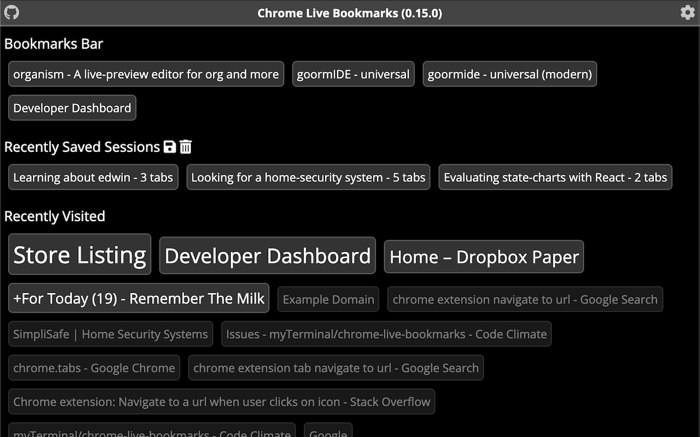

# chrome-live-bookmarks

  

  

A smarter New Tab replacement for Google Chrome with easy access to most frequently visited bookmarks

You can install it from the [Chrome Web Store](https://chrome.google.com/webstore/detail/chrome-live-bookmarks/fconcakelnfiacccnghcjhbmddloahfn).

## Features

* Replaces the default 'New Tab' page with an opinionatedly better implementation that combines bookmarks with history
* Supports light and dark color-themes
* More to come...

## To-do

* Also show bookmarks that are not on the bookmarks bar
* Add option to modify the list
* Improve visuals
